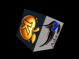

# Ada hello world on DreamCast

Thanks to [rust-for-dreamcast](https://github.com/darcagn/rust-for-dreamcast/)!
The rotating cube has been directly ported from the Rust example.

## Requirements
* Ada-enabled [KallistiOS toolchain](https://github.com/dkm/KallistiOS)
* [KallistiOS Ada Runtime](https://github.com/dkm/kallistios_ada_runtime)
* gprbuild (18 from debian is too old, 22 is known to work). Use
  [GNAT-FSF-builds
  releases](https://github.com/alire-project/GNAT-FSF-builds/releases/tag/gprbuild-22.0.0-1)
  for example.

## Building instructions
### Toolchain
To build the KallistiOS toolchain, you need a matching GNAT compiler. As of this
writting, GCC 13.2 with Ada enabled should be OK.
``` sh
$ cd $SOME_ROOT && git clone -b dkm/ada_support https://github.com/dkm/KallistiOS.git
```

And follow the regular KallistiOS build instructions.

### The sample Hello world + OpenGL example
- Clone [KallistiOS Ada Runtime](https://github.com/dkm/kallistios_ada_runtime):
``` sh
$ cd $SOME_ROOT && git clone https://github.com/dkm/kallistios_ada_runtime.git
```
- Clone this repository:
``` sh
$ cd $SOME_ROOT && git clone https://github.com/dkm/dchelloworld.git
```
- Generate bindings and texture files

``` sh
$ gen.sh
```
- Build the applications
``` sh
$ cd $SOME_ROOT/dchelloworld/ && gprbuild  -f  dchelloworld.gpr -XRUNTIME_BUILD=Production
```

Execute with `lxdream` if you don't have a DreamCast (like me!).
``` sh
$ lxdream-nitro  -u -e ./bin/gldemo2
```


## Debug

- run the emulator

``` sh
$ lxdream-nitro --gdb-sh4=1235 -n  -u -e ./bin/dchelloworld
```

- attach `gdb`

``` sh
$ gdb-multiarch  --eval "target remote localhost:1235" bin/dchelloworld
```

Break on `init` or `__ada_dchelloworld`.
